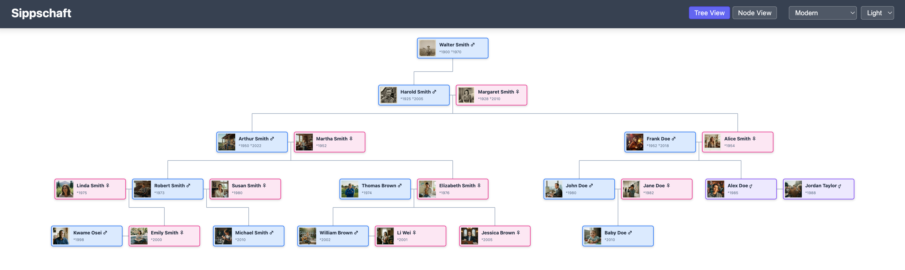
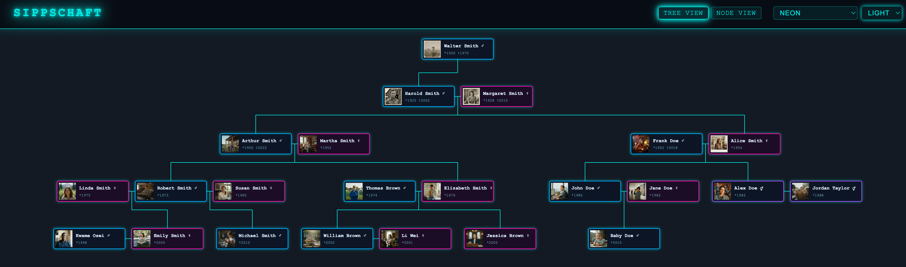
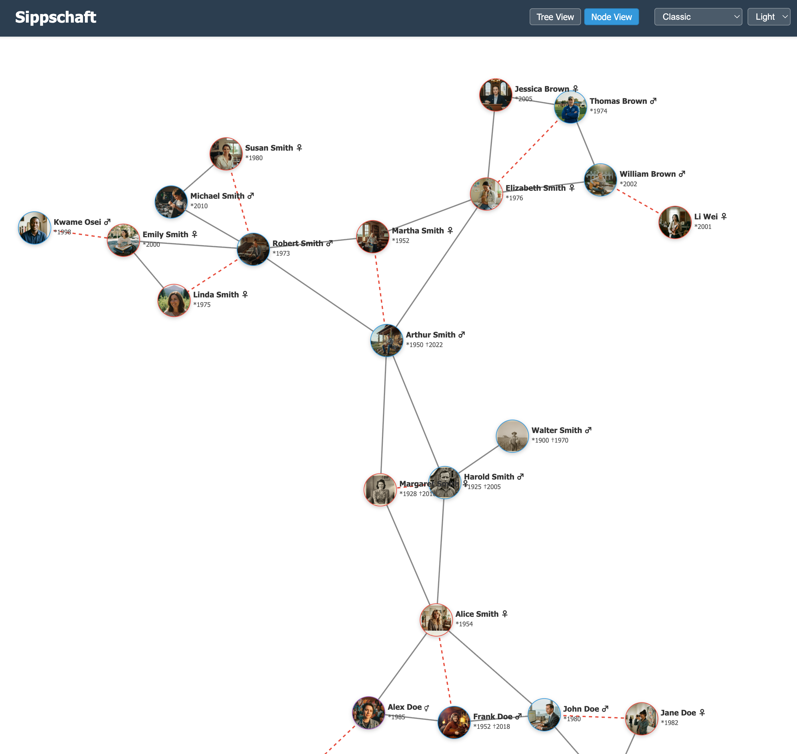
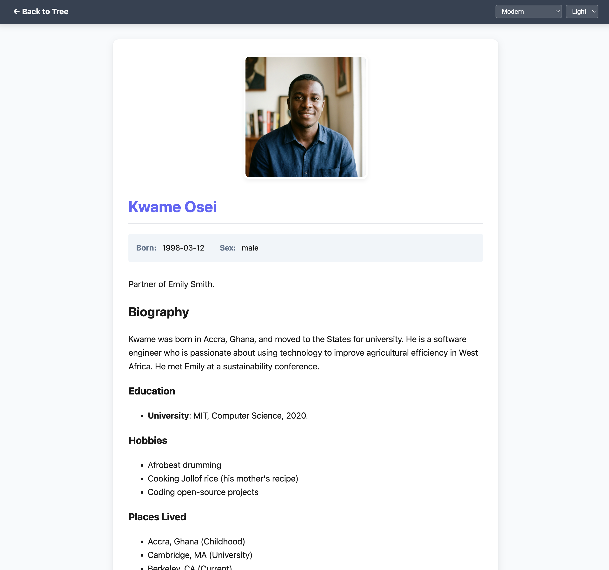

# Sippschaft

A family tree web app that visualizes genealogy data as an interactive tree. Family members are defined as simple Markdown files, making it easy to build and maintain your family history.

## Screenshots

### Tree View

Hierarchical family tree layout with parents above children, spouses side by side, and avatar photos on each node. Shown here with the Modern theme.



The same tree in the Neon theme, featuring a cyberpunk aesthetic with glowing cyan borders, monospace typography, and a dark background.



### Node View

Physics-based force-directed graph where nodes can be dragged freely. Solid lines connect parents to children; dashed red lines connect spouses.



### Person Profile

Clicking a node opens the person's profile page with photo, dates, biography rendered from Markdown, and links to relatives.



## Documentation

- [Person Author Guide](doc/person-guide.md) -- how to add and edit family members
- [Changelog](CHANGELOG.md)
- [Features & Roadmap](doc/features.md)
- [Ideas](doc/ideas.md) -- future feature concepts and rough designs
- [Architecture (arc42)](doc/architecture.md)
- [Vision & Principles](doc/vision.md)
- [Personas](doc/personas.md)
- [Architecture Decision Records](doc/adr/)

## Adding Family Members

Each person is a folder in `data/` named `{birth-date}_{surname}_{firstname}`:

```
data/
  1982-05-20_doe_jane/
    person.yaml     # structured metadata
    person.md       # biography (Markdown)
    avatar.png      # profile photo (optional)
```

See the [Person Author Guide](doc/person-guide.md) for the full YAML reference, name history, nicknames, and tips.

## Running the App

### Using a pre-built release (no Go required)

Download the latest archive for your platform from the [Releases](https://github.com/bjblazko/sippschaft/releases) page:

| Platform | Archive |
|----------|---------|
| Linux (x86-64) | `sippschaft-vX.Y.Z-linux-amd64.tar.gz` |
| macOS Intel | `sippschaft-vX.Y.Z-darwin-amd64.tar.gz` |
| macOS Apple Silicon | `sippschaft-vX.Y.Z-darwin-arm64.tar.gz` |
| Windows (x86-64) | `sippschaft-vX.Y.Z-windows-amd64.zip` |

Extract the archive and run the binary:

```
./sippschaft
```

The archive includes the `static/` and `templates/` directories the app needs at runtime. Place your family data in a `data/` directory next to the binary (or use `--data` to point elsewhere).

### Building from source

Make sure [Go](https://go.dev/) is installed, then:

```
go run main.go
```

Open [http://localhost:8080](http://localhost:8080) in your browser.

### Configuration

By default the app reads family data from the `data/` directory. To use a different directory:

```
./sippschaft --data /path/to/my/family
```

Or set the `SIPPSCHAFT_DATA` environment variable:

```
SIPPSCHAFT_DATA=/path/to/my/family ./sippschaft
```

To listen on a different port (default is 8080):

```
./sippschaft --port 3000
```

Or set the `SIPPSCHAFT_PORT` environment variable:

```
SIPPSCHAFT_PORT=3000 ./sippschaft
```

## Exporting as Static Site

Click the **Export** button in the header (or visit `/export`) to download the entire family tree as a ZIP archive. The ZIP contains a self-contained static site that works without a server -- just unzip and open `index.html` in a browser. Theme switching is fully supported. You can also deploy the exported files to any static hosting service.
