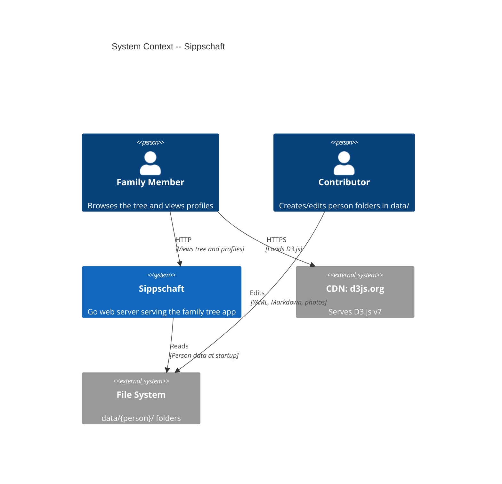
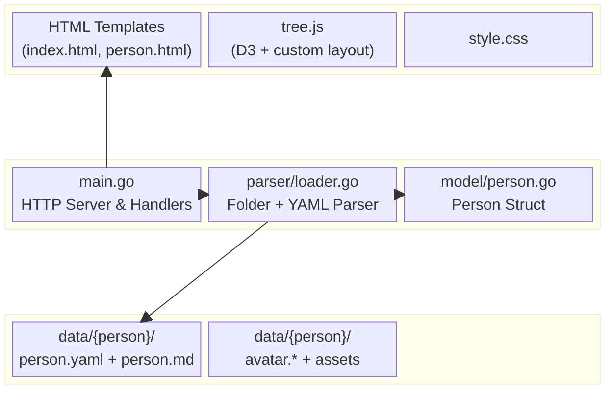
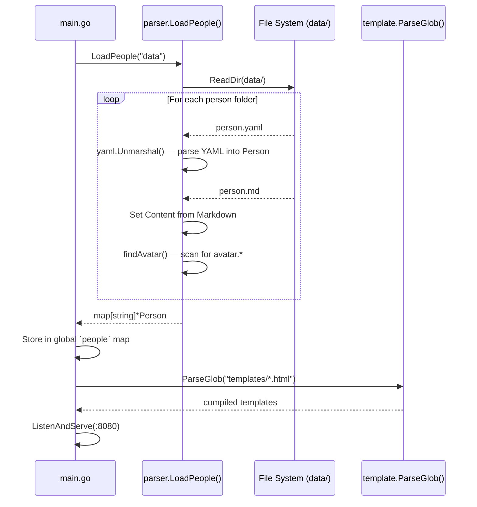
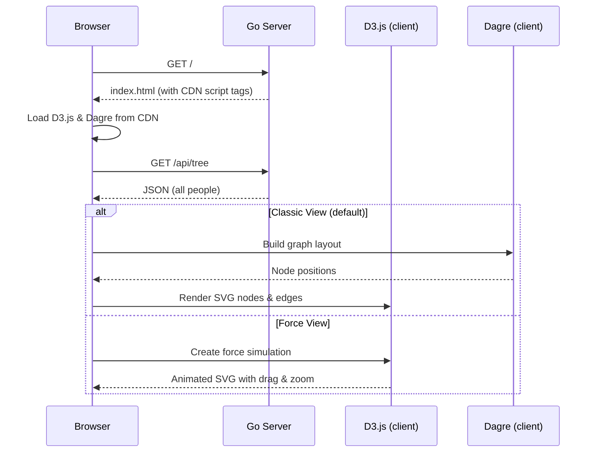
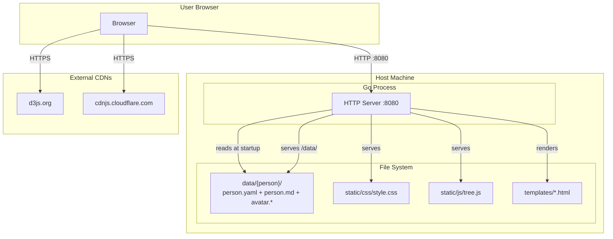

# Sippschaft -- Architecture (arc42)

> Chapters selected for relevance to this project's scope. Chapters 2 (Constraints), 8 (Crosscutting Concepts), 10 (Quality Requirements), and 12 (Glossary) are omitted as they add little value at this scale.

---

## 1. Introduction and Goals

### Requirements Overview

Sippschaft is a self-hosted family tree web app. Each family member is a folder containing a YAML metadata file, a Markdown biography, and optional assets (photos, documents). The app renders an interactive tree visualization and individual profile pages.

**Key functional requirements:**

| # | Requirement | Status |
|---|-------------|--------|
| F1 | Display an interactive family tree on the homepage | Done |
| F2 | Support two visualization modes (classic hierarchical, force-directed) | Done |
| F3 | Show person detail pages with photo, dates, biography, and relationships | Done |
| F4 | Load family data from person folders at startup | Done |
| F5 | Expose a JSON API for the frontend to consume | Done |
| F6 | Serve static assets (CSS, JS) and person data assets (photos) | Done |

### Quality Goals

| Priority | Quality Goal | Description |
|----------|-------------|-------------|
| 1 | Simplicity | Minimal dependencies, no database, no config. Clone and run. |
| 2 | Portability | Data is plain text files. Move the folder, move the tree. |
| 3 | Accessibility | Non-developers can add family members by editing Markdown. |

### Stakeholders

| Role | Expectations |
|------|-------------|
| Family Member (Browser) | Browse the tree, view profiles. No technical knowledge required. |
| Family Contributor (Editor) | Add/edit person files. Needs clear data format documentation. |
| Open Source User (Self-Hoster) | Fork, populate with own data, customize, and deploy. Needs clear project structure. |

See [personas.md](personas.md) for detailed persona descriptions.

---

## 3. Context and Scope

### System Context

### Boundary: What is inside vs. outside the system

| Inside | Outside |
|--------|---------|
| Go HTTP server | CDN-hosted JS libraries (D3, Dagre) |
| HTML templates | File system (data files, images) |
| Static assets (CSS, app JS) | User's browser |
| JSON API | |

---

## 4. Solution Strategy

| Decision | Rationale | ADR |
|----------|-----------|-----|
| Go standard library for HTTP | No framework overhead, single binary, zero config | [ADR-001](adr/001-go-stdlib.md) |
| Markdown files as data source | Human-readable, Git-friendly, no database | [ADR-002](adr/002-markdown-data.md) |
| D3.js + custom layout for visualization | D3 for SVG rendering/zoom, custom genealogy-aware layout algorithm | [ADR-003](adr/003-d3-dagre.md) |
| Goldmark for Markdown rendering | CommonMark-compliant, actively maintained | [ADR-004](adr/004-goldmark.md) |
| Folder-per-person data structure | Co-locates metadata, biography, and assets | [ADR-006](adr/006-folder-per-person.md) |

---

## 5. Building Block View

### Level 1: Top-Level Decomposition

### Level 2: Go Packages

---

## 6. Runtime View

### Scenario 1: Application Startup

### Scenario 2: Homepage Tree Rendering

### Scenario 3: Viewing a Person Profile

---

## 7. Deployment View

**Infrastructure requirements:**
- Any machine with Go installed (or a pre-built binary)
- No reverse proxy required (but recommended for production: nginx, Caddy)
- No database, no message queue, no external services
- Internet access needed for CDN-hosted JS (unless vendored locally)

---

## 9. Architecture Decisions

Recorded as individual ADR files in [doc/adr/](adr/):

| ADR | Title | Status |
|-----|-------|--------|
| [001](adr/001-go-stdlib.md) | Use Go standard library over a web framework | Accepted |
| [002](adr/002-markdown-data.md) | Markdown files as the data source (no database) | Accepted |
| [003](adr/003-d3-dagre.md) | D3.js for tree visualization (Dagre removed) | Superseded by 007 |
| [007](adr/007-custom-layout.md) | Custom genealogy layout replacing Dagre | Accepted |
| [004](adr/004-goldmark.md) | Goldmark for Markdown rendering | Accepted |
| [005](adr/005-yaml-frontmatter.md) | YAML frontmatter for person metadata | Superseded by 006 |
| [006](adr/006-folder-per-person.md) | Folder-per-person data structure | Accepted |
| [008](adr/008-theme-system.md) | CSS custom property theme system | Accepted |

---

## 11. Risks and Technical Debt

| # | Risk / Debt | Severity | Description |
|---|-------------|----------|-------------|
| R1 | No data validation | Medium | Referenced IDs (parents, spouses, children) are not checked for existence. Broken references fail silently in the UI. |
| R2 | No tests | Medium | No unit or integration tests exist. Regressions can only be caught manually. |
| R3 | CDN dependency | Low | D3.js is loaded from an external CDN. The app will not render the tree without internet access. Could be mitigated by vendoring. |
| R4 | Unidirectional relationships | Medium | If Alice lists Bob as a child, Bob does not automatically list Alice as a parent. Both sides must be manually maintained, which is error-prone. |
| R5 | No hot reload of data | Low | Person data is loaded once at startup. File changes require a server restart. Mitigated by using `air` during development. |
| R6 | Hardcoded port | Low | Port 8080 is hardcoded in `main.go`. Not configurable via environment variable or flag. |
| R7 | ~~Dagre unmaintained~~ | ~~Low~~ | ~~Resolved: Dagre replaced with custom genealogy layout algorithm.~~ |
| R8 | Raw HTML injection | Low | Biography Markdown is rendered to HTML and inserted via `template.HTML` (unescaped). Safe as long as data files are author-controlled, but becomes a risk if user-submitted content is ever allowed. |
